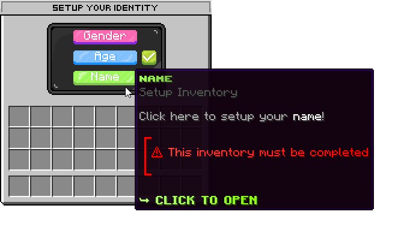

# Colors

## Colors

Colors follow the [MiniMessage Syntax](https://docs.advntr.dev/minimessage/format.html). You can refer to their documentation for more details.\
If you need **help** with colors, please don't hesitate to reach out to us on [discord](https://discord.mikeslab.it).

## Animations

<figure><figcaption>
Animations example from the Default Name, Gender &#x26; Age Preset
</figcaption></figure>

Animations are a beautiful part of Identity; you can animate elements text by using the following format, just like the **MiniMessage** format: `<animate:#color1:#color2></animate>` (The closing tag, as always, is optional and goes according to your needs). If you need help coloring, please visit the resource above.


To adjust the animation speed, navigate to the config and then to settings. Modify the '**animation-interval**' option to a lower value (**default**: 2, **min**: 1). **Note**: Lowering this value can **significantly impact performance**.

